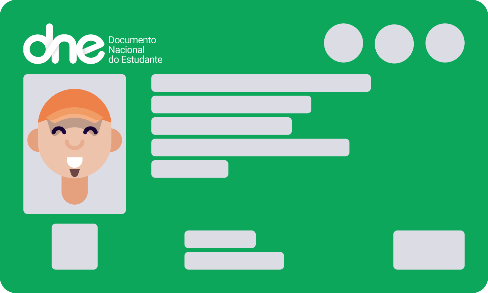
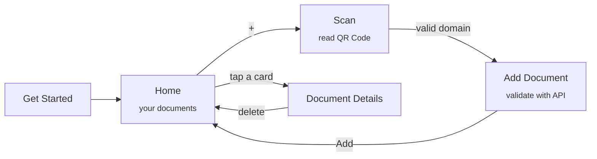
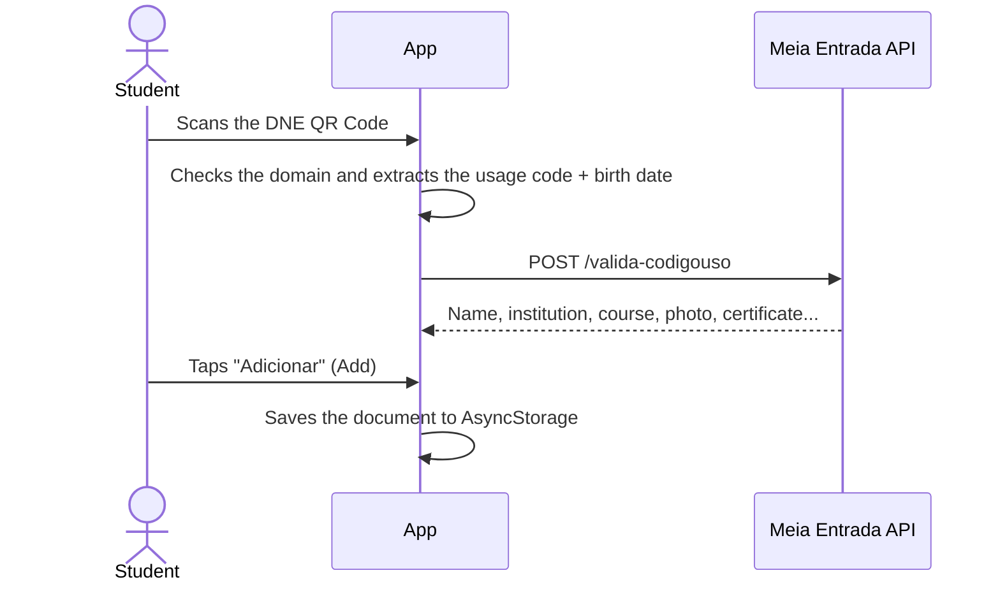

<div align="center">



# 🎓 DNE Digital

**Your student ID, fully digital. Scan the QR Code of your Brazilian National Student Document (DNE) and always keep it on your phone.**


[About](#-about) •
[Features](#-features) •
[How it works](#-how-it-works) •
[Getting started](#-getting-started) •
[Structure](#-structure) •
[Tech stack](#-tech-stack)

</div>

---

## 📖 About

The **DNE (Documento Nacional do Estudante)** is the Brazilian national student ID, issued by UNE, UBES and ANPG. It grants students half-price tickets at cultural and sports events, and every valid DNE carries a QR Code that links to its official validation.

**DNE Digital** is a mobile app that reads that QR Code, validates the document against the official Meia Entrada API and saves a digital copy on the device, so you always have your student ID at hand.

> ⚠️ This is an independent, unofficial project. It is not affiliated with UNE, UBES, ANPG or Meia Entrada.
>
> 🇧🇷 The app’s interface is in Brazilian Portuguese.

## ✨ Features

| | Feature | Description |
|---|---|---|
| 📷 | **QR Code scanning** | Reads the DNE QR Code with the device camera |
| 🔍 | **Domain validation** | Only accepts QR Codes from `dne.vc` or `meiaentrada.org.br` |
| ✅ | **Official validation** | Checks the document with the Meia Entrada API before saving it |
| 🪪 | **Digital document** | Shows name, document, birth date, institution, course and a QR Code |
| 💾 | **Offline storage** | Documents are saved on the device with AsyncStorage |
| 🗑️ | **Delete with confirmation** | Remove a document through a confirmation dialog |
| 📳 | **Haptic feedback** | Vibration on success and error, plus toast notifications |
| ✨ | **Animations** | Animated onboarding illustration with Moti and loading skeletons |

## 🔄 How it works





## 🚀 Getting started

### Prerequisites

- [Node.js](https://nodejs.org/) (LTS)
- The [Expo Go](https://expo.dev/go) app on your phone, or an Android/iOS emulator

### Step by step

```bash
# 1. Clone the repository
git clone https://github.com/agustinhopneto/dne-digital.git
cd dne-digital

# 2. Install the dependencies
npm install

# 3. Start the Expo dev server
npm start
```

Scan the QR Code shown in the terminal with Expo Go, or press `a` (Android) or `i` (iOS) to open an emulator.

> 📌 The project uses **Expo SDK 44**. Run it with a compatible Expo Go version or upgrade the SDK.

### Scripts

| Command | Description |
|---|---|
| `npm start` | Starts the Expo dev server |
| `npm run android` | Opens on Android |
| `npm run ios` | Opens on iOS |
| `npm run web` | Opens in the browser |

## 🗂️ Structure

```
src/
├── assets/          # Illustrations and DNE / UNE / UBES / ANPG logos
├── components/      # Button, CircleButton, Document, DocumentCard, Scanner, Toast, Alert...
├── hooks/
│   ├── document.tsx     # Validate, save, load and remove documents
│   └── notification.tsx # Toasts + haptic feedback
├── routes/          # Native stack navigation
├── screens/         # GetStarted, Home, Scan, AddDocument, DocumentDetails
├── services/
│   └── api.ts       # Axios client for the Meia Entrada API
├── styles/          # Colors, fonts and NativeBase theme
└── utils/           # Date formatting
```

## 🎨 Palette

| Token | Color |
|---|---|
| `primary` |  `#FF6200` |
| `secondary` |  `#8E008B` |
| `dark` |  `#2E203C` |
| `light` |  `#F2EEF6` |
| `dne` |  `#0DA75B` |

Font: **[Outfit](https://fonts.google.com/specimen/Outfit)**

## 🛠️ Tech stack

- **[React Native](https://reactnative.dev/)** + **[Expo](https://expo.dev/)**
- **[NativeBase](https://nativebase.io/)**: UI components and theming
- **[React Navigation](https://reactnavigation.org/)** (native stack)
- **[expo-barcode-scanner](https://docs.expo.dev/versions/v44.0.0/sdk/bar-code-scanner/)**: QR Code reading
- **[react-native-qrcode-svg](https://github.com/awesomejerry/react-native-qrcode-svg)**: QR Code rendering
- **[expo-haptics](https://docs.expo.dev/versions/latest/sdk/haptics/)**: haptic feedback
- **[Moti](https://moti.fyi/)** + **[Reanimated](https://docs.swmansion.com/react-native-reanimated/)**: animations
- **[AsyncStorage](https://react-native-async-storage.github.io/async-storage/)**: local persistence
- **[Axios](https://axios-http.com/)**: HTTP client
- **ESLint (Airbnb) + Prettier**

---

<div align="center">

Made with 💙 by **[Agustinho Neto](https://github.com/agustinhopneto)**

</div>
